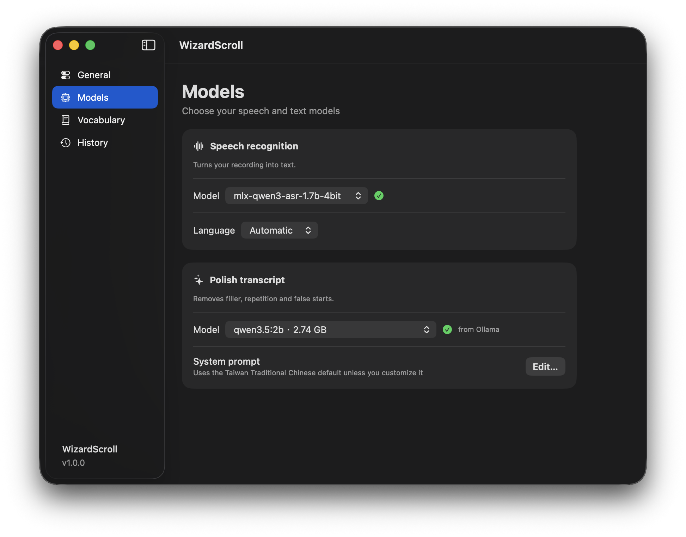

  

<h1 align="center">WizardScroll</h1>

<strong>Speak. Polish. Paste.</strong>

  Local dictation for your Mac, powered by Qwen. 
  Turn your voice into clean text in the app you are using.

  <strong>v1.0.1</strong> · macOS 14+ · Apple Silicon

  <a href="https://github.com/lileetung/wizardscroll/releases/latest">Download v1.0.1</a> ·
  <a href="#use">How to use</a> ·
  <a href="#models">Models</a> ·
  <a href="#privacy">Privacy</a>

  

## What it does

- **Dictate anywhere.** Hold **Right ⌥**, speak, and release to insert text at your cursor. Or switch to pressing once to start and again to stop. You can change the shortcut.
- **Clean up natural speech.** Remove filler and false starts, add punctuation, and keep your meaning, tone, uncertainty and emphasis.
- **Run locally.** Speech recognition and text polishing both run on your Mac. Nothing else to install.
- **Reuse your Ollama models.** If you use [Ollama](https://ollama.com), WizardScroll polishes with the models you already have instead of downloading another one.
- **Learn your vocabulary.** Add names, products and phrases to help both models recognize their spelling.
- **Set up models automatically.** The app downloads the models it needs on its own.
- **Keep it simple.** A menu bar app with a small recording indicator and the latest 10 transcripts in History.

The default polishing rules use Taiwan Traditional Chinese while preserving English and mixed-language text. Dictated questions and commands remain text to edit. You can customize the system prompt in **Models → System prompt → Edit…**.

## Install

### Requirements

- An Apple Silicon Mac with **macOS Sonoma 14 or later**.
- An internet connection for initial setup and model downloads.

### Get started

1. Download **WizardScroll-1.0.1.dmg** from [GitHub Releases](https://github.com/lileetung/wizardscroll/releases/latest).
2. Open the DMG and drag **WizardScroll** into **Applications**.
3. Open **WizardScroll** from Applications. Its Settings window opens, and it prepares its local runtime and downloads the selected models automatically.
4. In **Models**, wait for the green checks beside both models.
5. In **General → Accessibility → Open Settings**, allow WizardScroll to listen for **Right ⌥** and insert text into other apps. Allow microphone access when you first start dictation.

If setup needs attention, expand **General → Environment check**. Model downloads show progress and offer **Retry download** after a failure.

## Use

1. Place your cursor in a text field.
2. Hold **Right ⌥** (the Option key on the right) and speak.
3. Release **Right ⌥** when you finish.

WizardScroll transcribes, polishes and inserts your text.

To open Settings again, open **WizardScroll** from Applications or choose **Settings…** from its menu bar icon.

Pressing **Right ⌥** with another key, such as ⌥ E to type an accent, does not start dictation, so the key keeps working as Option. **Left ⌥** never starts dictation.

To change the shortcut, click it in **General → Shortcut** and press the new combination. It needs ⌘, ⌥ or ⌃, unless it is an F-key or a right-hand modifier (⌥, ⌘, ⌃ or ⇧) pressed on its own. By default, **Recording mode** is **Hold to talk**: it records only while the shortcut is held, and a tap shorter than 0.3 seconds is ignored. Set it to **Press to toggle** to press once to start and again to stop.

If automatic insertion is unavailable, the result stays on your clipboard. Press **⌘V** to paste it. If the text model is still downloading or polishing fails, the original transcript is preserved.

| Settings | What you can do |
| --- | --- |
| **General** | Check setup, enable Accessibility, and change the shortcut or recording mode. |
| **Models** | Choose speech and text models, select a language, or edit the polishing prompt. |
| **Vocabulary** | Save names, technical terms and phrases. |
| **History** | Review and copy your latest 10 transcripts. |

## Models

Speech recognition uses [moona3k/mlx-qwen3-asr-0.6b-4bit](https://huggingface.co/moona3k/mlx-qwen3-asr-0.6b-4bit) or [moona3k/mlx-qwen3-asr-1.7b-4bit](https://huggingface.co/moona3k/mlx-qwen3-asr-1.7b-4bit). Text polishing uses the first of these that is available:

1. **A text model in your Ollama.** WizardScroll lists the local text models installed in Ollama and picks a Qwen model when there is one. You can choose another in **Models**. If Ollama is installed but not running, WizardScroll opens it. Cloud and embedding models are not listed.
2. **[Qwen3.5-4B-MLX-4bit](https://huggingface.co/mlx-community/Qwen3.5-4B-MLX-4bit)**, about 3.1 GB, which WizardScroll downloads only when Ollama is not installed or has no local text model. It fits comfortably on a 16 GB Mac.

The polishing model loads when you start dictating and stays in memory between dictations, so they do not wait for it.

## Privacy

- Audio and text are processed locally, including polishing.
- Temporary recordings are deleted after processing.
- Only the latest 10 transcripts are kept in local History.
- No account, API key, subscription or analytics is required by WizardScroll.

Once setup and downloads finish, dictation works offline.

## Help

macOS blocks the first launch

For a release downloaded from this repository, try opening the app, then go to **System Settings → Privacy & Security → Open Anyway**. See [Apple's instructions for opening downloaded apps](https://support.apple.com/en-us/102445).

Right ⌥ does nothing

WizardScroll needs Accessibility access to notice a modifier key pressed on its own. Enable it in **System Settings → Privacy & Security → Accessibility**, as described below. The shortcut also does not work while a password field is focused, because macOS hides key presses from other apps there.

Text is copied instead of inserted

Enable WizardScroll in **System Settings → Privacy & Security → Accessibility**, then focus an editable text field. If an older permission entry no longer works, remove it and add the installed app from Applications again. You can paste the copied result with **⌘V** meanwhile.

A model is not ready

Make sure your internet connection is available and you have room for the download. Open **Models** to check progress or choose **Retry download**. Use **General → Environment check** to review missing dependencies.

## Acknowledgements

Powered by [Qwen](https://github.com/QwenLM), [MLX](https://github.com/ml-explore/mlx), [MLX LM](https://github.com/ml-explore/mlx-lm) and [Ollama](https://github.com/ollama/ollama). The scroll icon is from [Phosphor Icons](https://phosphoricons.com) (MIT). The polishing rules were informed by the public prompts in [VoiceInk](https://github.com/Beingpax/VoiceInk), [OpenWhispr](https://github.com/OpenWhispr/openwhispr) and [Murmur](https://github.com/paretoimproved/murmur), with original wording for WizardScroll.
